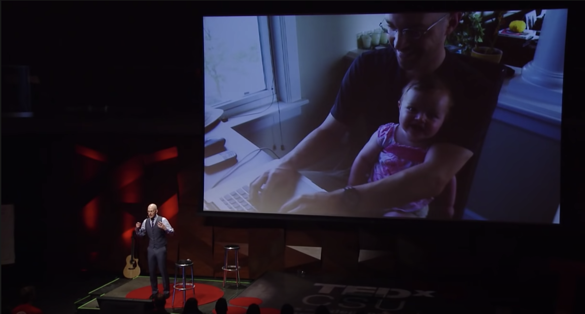
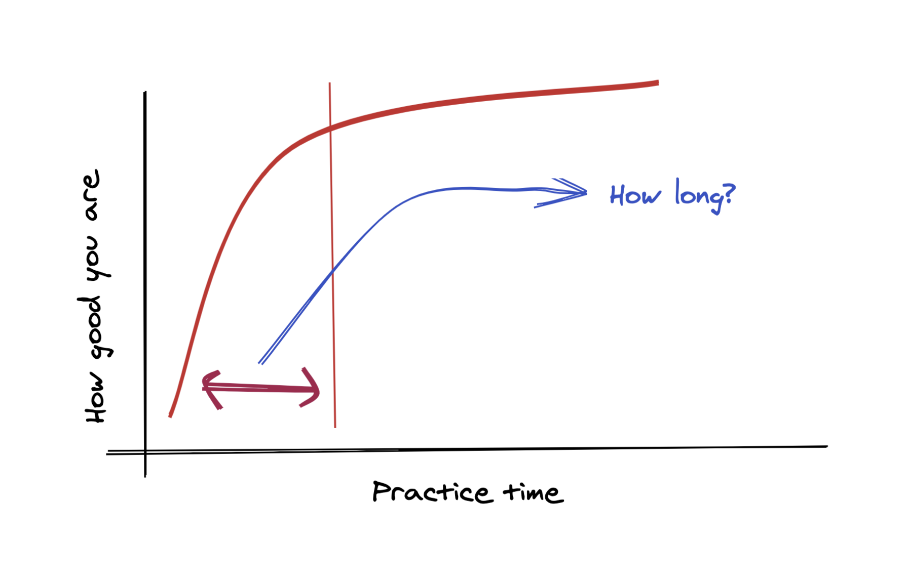

Di Sabtu sore yang cerah, dalam rangka mensukseskan acara mingguan saya yaitu *weekend* rebahan, saya memutuskan untuk berselancar di aplikasi Youtube, alih-alih menemukan video pranknya Hatta Halilintar saya malah menemukan satu video yang lebih menarik perhatian, kali ini saya akan berbagi tentang video tersebut. Tepatnya dari channel TED Talks. Video yang diunggah beberapa tahun yang lalu ini menampilkan seorang Josh Kaufman yang mempresentasikan sebuah hasil riset tentang berapa lama waktu yang dibutuhkan seseorang untuk bisa mendapatkan *skill* baru.

Video itu dimulai dengan Josh yang bercerita tentang suatu momen yang kala itu sangat mengubah hidupnya. Ya, dia dianugerahi seorang anak perempuan. *Wah* selamat ya Josh. Menurut dia menjadi orang tua adalah pengalaman yang sangat luar biasa. Josh beserta istrinya berubah menjadi pasangan yang super sibuk, mereka harus belajar dan membiasakan diri mengurus si buah hati. Terlebih mereka juga harus menjalankan bisnis nya dari rumah, kebayangkan sibuknya si Josh ini.

Sambil menampilkan foto ia dan anaknya pada *slide*. Josh melanjutkan ceritanya, bahwa setelah beberapa minggu menjalani hidup sebagai orang tua, Josh menyadari, mungkin hal ini juga dirasakan oleh seluruh orang tua di dunia, bahwa **ia sama sekali tidak memiliki waktu luang**. Sehingga dia berpendapat, saat itu dirasa sangat sulit untuk melakukan hal-hal baru selain mengerjakan bisnis dan tugas sebagai orang yang memiliki anak. Padahal, Josh adalah salah satu tipe orang yang selalu ingin belajar hal baru dan mencoba keterampilan baru. Singkat cerita, akhirnya dia pergi ke perpustakaan dan juga toko buku. Untuk apa? dia ingin mencari jawaban atas pertanyaan _"How long does it take to acquire a new skill?"._

## Berapa lama sih sebenernya waktu yang dibutuhkan seseorang untuk bisa mempelajari sebuah keterampilan baru?

### Jawabannya adalah 10.000 jam.

Setelah membaca banyak buku dan juga website, Josh menemukan jawabannya. Ya, jawabannya adalah 10 ribu jam yang dibutuhkan seseorang jika ingin terampil dan mahir pada _skill_ tertentu. Gila juga ya, si Josh mana punya waktu sebanyak itu. Jika dikalkulasi, 10 rb jam itu sama dengan seseorang bekerja full-time selama 5 tahun. Mungkin orang yang biasa rebahan yang *ngebet* mau belajar hal baru, mendengar fakta ini bakalan milih untuk rebahan selamanya.

Etts, tapi tunggu dulu!

Faktanya, 10.000 jam merupakan waktu yang dibutuhkan bagi mereka yang ingin mempunyai *skill* atau keterampilan di-level *expert*. Adalah K. Andrers Ericsson seorang profesor di *Florida State University*, ia merupakan orang yang melakukan penelitan dan menghasilkan 10.000 jam _rule_. Penelitian tersebut merupakan hasil dari wawancara beliau dengan profesional atlet, musisi kelas dunia, juara dunia catur, dengan kata lain, orang-orang yang diwawancarai adalah orang-orang yang memiliki skill tingkat dewa di bidangnya masing-masing. Bagaimana mereka bisa mencapai kesuksesan tertinggi di bidangya, dan berapa lama waktu yang mereka habiskan untuk berlatih hingga mendapat gelar juara dunia. Dan jawabannya adalah rata-rata mereka telah menghabiskan waktu sekitar 10 ribu jam untuk berlatih.

_Gak_ puas dengan jawaban yang didapat, akhirnya Josh melakukan penelitiannya sendiri.

Dari penelitian milik Dr. Ericsson, yang Josh pelajari adalah seseorang akan menjadi terbiasa atau bahkan *expert* dengan *skill* nya ketika mereka melakukan latihan yang terus menerus. Masalahnya adalah, mungkin saja ga semua orang ingin belajar skill baru dengan tujuan ingin menjadi expert di bidangnya, bagaimana dengan orang yang cuma sekedar ingin bisa. Apakah orang itu juga butuh waktu 10 ribu jam?
Jadi, berdasarkan grafik di atas, Josh mulai mencari tau seberapa lama waktu yang dibutuhkan seseorang untuk "menjadi bisa" pada *skill* tertentu. Dan ia mencapai pada sebuah kesimpulan, bahwa jika seseorang ingin belajar *skill* baru, baik itu *skill* yang bersifat fisik ataupun *skill* yang bersifat mental yang ia butuhkan adalah, berlatih selama **20 jam**.

## The First 20 Hours ~ How to learn anything!

Di mulai dari yang tidak tau apa-apa tentang hal yang ingin kita pelajari, bisa jadi ingin belajar bahasa baru, belajar bagaimana caranya menggambar, ingin belajar basic tentang sulap atau ingin belajar melupkan sesorang yang pernah menyakiti kita. Jika kita menyediakan waktu 20 jam untuk fokus berlatih ke hal-hal tersebut, si Josh bilang, kita pasti akan kaget dengan pencapaian tersebut. 20 jam rule sangat bisa dilakukan, tidak harus berturut-turut, kita bisa membaginya dengan 45 menit sehari, itu berarti bisa ditempuh kurang dari satu bulan.

### 4 Langkah Belajar Apapun dalam 20 Jam

Untuk mencapai ini ga bisa dilakukan sembarangan, setidaknya ada 4 langkah yang harus bener-bener dilakukan untuk belajar *skill* apapun dalam waktu 20 jam.

### Pertama, Untuk Memulai nya Kamu Harus Tentukan Hal-Hal Apa Saja yang Benar-Benar ingin Dipelajari dari skill tersebut.

Satu *skill* bisa jadi membutuhkan banyak hal yang harus dipelajari, tugas pertama kita adalah, mem-_breakdown_ hal-hal apa yang paling penting yang jika kita telah mencapai itu, berarti kita sudah cukup baik menguasai skill tersebut. Misal, katakanlah kita mau belajar bermain gitar, kita bisa persempit dengan memilih satu lagu yang dirasa cukup jika kita bisa mengiringinya dengan gitar. Satu lagu tersebut tentu tidak menggunakan semua kunci atau nada lagu, 4 sampai 6 kunci harusnya cukup. Nah kita bisa mulai dengan belajar berdasarkan kunci-kunci tersebut.

### Segera koreksi ketika kita sadar ada kesalahan selama latihan.

Pada tahap ini kita diharuskan mencari 2 sampai 3 refrensi, bisa dari buku, video, kursus atau bisa apapun. Tapi jangan gunakan semua itu sebagai patokan baku atau jangan berpendapat bahwa kita hanya bisa mendapatkan *skill* yang diinginkan ketika selesai mempelajari semua refrensi itu. Pada tahap ini kita ditekankan untuk _Learn enough to self-correct_. Artinya, dari refrensi yang ada kita bisa menentukan hal-hal penting yang perlu dilakukan dan dengan cepat memperbaiki ketika kita mengalami kesalahan selama latihan.

### Ketiga, Isolasi diri dari distraksi, bisa jadi internet ataupun TV.

Hindari segala distraksi, internet atau bahkan TV. Semua itu bisa mengganggu fokus kita selama latihan nanti. Memfokuskan diri selama 45 menit sehari menjauh dari Internet untuk latihan, hmmm tentu tahap ini kayanya nggak sulit-sulit amat.

### Keempat, Berlatih setidaknya 20 Jam.

Yeap, sesuai namanya, pastikan kita benar-benar menghabiskan waktu setidaknya 20 jam untuk latihan. Seperti yang dibahas tadi latihannya harus fokus.

## Kesimpulan

10.000 jam rule sudah sangat populer di dunia, bahkan buku nya sudah menjadi best-seller dari tahun ke tahun. Tapi seiring kepopulerannya, ternyata metode ini dirasa cukup memberatkan untuk orang-orang yang hanya ingin sekedar bisa pada *skill* tertentu, tidak sedikit orang yang hanya ingin bisa memainkan gitar untuk mennyanyikan lagu tertentu saja, bukan untuk menjadi pencipta lagu ataupun musisi. Ada juga orang yang ingin bisa menulis hanya untuk menyurahkan isi hati dan pikirannya tanpa harus menjadi penulis profesional. Kini setiap orang bisa mempelajari *skill* apapun baik *skill* fisik maupun mental skill dengan memanfaatkan metode 20 jam pertama untuk belajar apapun.

Lalu, apaka metode ini bener-bener terbukti? Nah sebelum Josh mengakhiri presentasinya, dia menunjukan *skill* bermain ukulele yang tentunya ia menggunakan metode 20 jam untuk berlatih dari nol.

Simak videonya di sini. 👇

[The first 20 hours -- How to Learn Anything | Josh Kaufman | TEDxCSU](https://youtu.be/5MgBikgcWnY?t=735)
